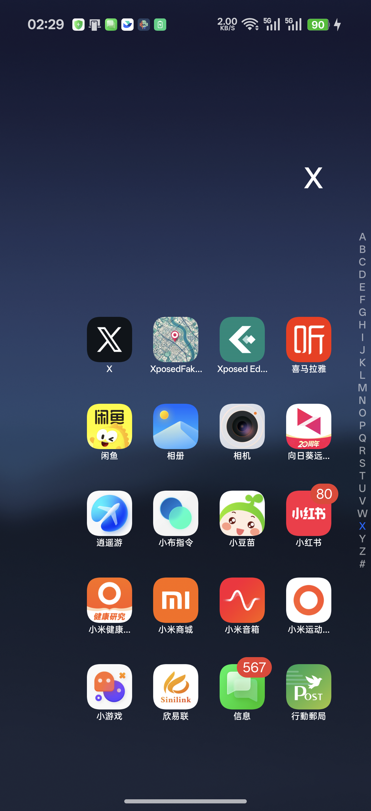

# RealmeUI Spanish Enabler

一款为 RealmeUI / ColorOS 设备启用西班牙语的轻量 Android 应用，支持 ROOT、Shizuku 和 AxManager 三种授权方式。

[【机场推荐：白月光，稳定高速】](https://www.sibker.com/register?invite_code=2XQR1UUz)

部分中国版设备的语言设置界面会隐藏西班牙语，即使系统中仍然保留了相应语言资源。本应用可以直接将系统语言切换为 `es-ES`，并支持恢复 ROM 默认语言。



## 功能

- 首次启动可选择 ROOT、Shizuku 或 AxManager 授权
- 记住所选授权方式，点击主界面的授权状态可重新选择
- 一键启用西班牙语 `es-ES`
- 一键恢复 ROM 默认语言
- 支持即时生效，无需重启
- 即时切换失败时自动写入系统设置，可重启后生效
- 提供安全确认后的重启按钮
- 界面支持中文、English 和 Español
- ROOT 支持 Magisk、KernelSU、APatch 等方案

## 下载

请从 [Releases](https://github.com/daxiaamu/RealmeUI-Spanish-Enabler/releases) 下载最新 APK。

## 使用要求

- Android 8.0 或更高版本
- 以下授权方式任选一种：
  - ROOT：Magisk、KernelSU 或 APatch
  - Shizuku：先启动 Shizuku 服务，再在应用中授权
  - AxManager：先启动服务并开启 `AX-Permission Intercept`，再在应用中授权
- ROM 中仍保留西班牙语资源；缺失的系统翻译可能回退到中文或英文

## 实现原理

ROOT 模式会为应用授予 `android.permission.CHANGE_CONFIGURATION`，再调用 ActivityManager 的系统配置接口即时更新语言；若普通应用进程受到隐藏 API 限制，则通过 ROOT `app_process` 助手再次尝试。

Shizuku 模式使用官方 UserService 在 ADB shell 权限下执行相同操作。AxManager 模式使用其 `AX-Permission Intercept` 提供的 Shizuku 兼容授权通道，无需 ROOT。

即时切换失败时，应用仍会写入：

```shell
settings --user current put system system_locales es-ES
```

该兜底方式需要重启后才能完整生效。

## 构建

需要 JDK 17、Android SDK 37 和 Gradle 9.4.1：

```shell
./gradlew assembleDebug
```

生成文件位于 `app/build/outputs/apk/debug/app-debug.apk`。

## 已验证设备

- 真我 GT 8
- RealmeUI 7.0

实测 `zh-CN → es-ES` 和 `es-ES → zh-CN` 均可在不重启的情况下即时生效。新增的 Shizuku 与 AxManager 授权方式仍建议在目标设备上分别验证。

## 注意

切换系统语言属于高权限操作。请确认设备已备份重要数据，并只从本仓库下载 APK。

开发者：大侠阿木（[daxiaamu.com](https://daxiaamu.com)）
